# Proyecto2_MB_GuadalupeVillena

API REST de MiniBlog desarrollada con Node.js, Express y PostgreSQL.

## Tecnologías utilizadas

- Node.js
- Express
- PostgreSQL
- pg
- Jest
- Supertest
- Swagger / OpenAPI
- Railway

## Funcionalidades

La API permite gestionar autores y publicaciones.

### Authors

- GET `/authors`
- GET `/authors/:id`
- POST `/authors`
- PUT `/authors/:id`
- DELETE `/authors/:id`

### Posts

- GET `/posts`
- GET `/posts/:id`
- GET `/posts/author/:authorId`
- POST `/posts`
- PUT `/posts/:id`
- DELETE `/posts/:id`

## Instalación local

Clonar el repositorio:

```bash
git clone https://github.com/lupevillena/Proyecto2_MB_GuadalupeVillena.git
```

Entrar a la carpeta del proyecto:

```bash
cd Proyecto2_MB_GuadalupeVillena
```

Instalar las dependencias:

```bash
npm install
```

## Configuración

Crear un archivo `.env` en la raíz del proyecto tomando como referencia el archivo `.env.example`.

Ejemplo:

```env
DB_USER=postgres
DB_HOST=localhost
DB_NAME=ft78_guadalupevillena
DB_PASSWORD=your_password
DB_PORT=5432
PORT=3000
```

El archivo `.env` está incluido en `.gitignore` para evitar subir información sensible al repositorio.

## Base de datos

El proyecto utiliza PostgreSQL como sistema de base de datos.

Se incluyen los siguientes archivos SQL:

- `setup.sql`: crea las tablas necesarias.
- `seed.sql`: inserta datos iniciales para probar la aplicación.

Las entidades principales son:

### Authors

- `id`
- `name`
- `email`
- `bio`
- `created_at`

### Posts

- `id`
- `author_id`
- `title`
- `content`
- `published`
- `created_at`

Existe una relación de uno a muchos entre autores y posts: un autor puede tener varios posts.

## Ejecutar el proyecto localmente

Para iniciar el servidor:

```bash
npm start
```

El servidor estará disponible en:

```text
http://localhost:3000
```

## Endpoints

### Authors

#### Obtener todos los autores

```text
GET /authors
```

#### Obtener un autor por ID

```text
GET /authors/:id
```

#### Crear un autor

```text
POST /authors
```

Ejemplo de body:

```json
{
  "name": "Ana Pérez",
  "email": "ana@example.com",
  "bio": "Desarrolladora backend"
}
```

#### Actualizar un autor

```text
PUT /authors/:id
```

#### Eliminar un autor

```text
DELETE /authors/:id
```

### Posts

#### Obtener todos los posts

```text
GET /posts
```

#### Obtener un post por ID

```text
GET /posts/:id
```

#### Obtener los posts de un autor

```text
GET /posts/author/:authorId
```

Este endpoint devuelve los posts junto con información del autor.

#### Crear un post

```text
POST /posts
```

Ejemplo de body:

```json
{
  "title": "Mi primer post",
  "content": "Contenido del post",
  "author_id": 1,
  "published": true
}
```

#### Actualizar un post

```text
PUT /posts/:id
```

#### Eliminar un post

```text
DELETE /posts/:id
```

## Validaciones y manejo de errores

La API incluye las siguientes validaciones:

- El nombre del autor es obligatorio.
- El email del autor es obligatorio.
- El email del autor debe ser único.
- El título del post es obligatorio.
- El contenido del post es obligatorio.
- El `author_id` es obligatorio.
- Se valida que el autor asociado a un post exista.
- Se manejan recursos no encontrados.
- Se utiliza un middleware global para errores internos.

La API utiliza códigos HTTP como:

- `200` - Solicitud exitosa.
- `201` - Recurso creado correctamente.
- `400` - Datos inválidos.
- `404` - Recurso no encontrado.
- `500` - Error interno del servidor.

## Arquitectura del proyecto

La aplicación está organizada separando rutas, servicios, conexión a la base de datos, validaciones y manejo de errores.

```text
src/
├── routes/
│   ├── authors.routes.js
│   └── posts.routes.js
├── services/
│   ├── authors.service.js
│   └── posts.service.js
├── middlewares/
│   ├── errorHandler.js
│   ├── validateAuthor.js
│   ├── validatePost.js
│   └── validated.js
├── app.js
├── index.js
└── pool.js
```

Las rutas gestionan las solicitudes y respuestas HTTP.

Los services contienen las consultas SQL y la lógica de acceso a PostgreSQL.

La conexión a la base de datos está centralizada en `pool.js`.

El archivo `index.js` inicia el servidor utilizando el puerto definido por `process.env.PORT` o el puerto `3000` en entorno local.

Las consultas SQL utilizan parámetros como `$1`, `$2`, etc., evitando concatenar directamente los valores recibidos.

## Tests automáticos

El proyecto utiliza:

- Jest
- Supertest

Para ejecutar los tests:

```bash
npm test
```

El proyecto incluye 7 tests automáticos para comprobar endpoints, códigos HTTP y validaciones de Authors y Posts.

Resultado de las pruebas:

```text
Test Suites: 1 passed, 1 total
Tests:       7 passed, 7 total
```

## Swagger / OpenAPI

La documentación OpenAPI se encuentra configurada en el proyecto.

Con el servidor ejecutándose localmente, Swagger UI puede visualizarse en:

```text
http://localhost:3000/api-docs
```

Desde Swagger se pueden consultar los endpoints disponibles de Authors y Posts.

## Deploy en Railway

La aplicación fue desplegada utilizando Railway.

El proyecto utiliza dos servicios dentro de Railway:

- Un servicio para la aplicación Node.js / Express.
- Un servicio PostgreSQL para la base de datos.

### Proceso de deployment

1.Se subió el proyecto al repositorio de GitHub.
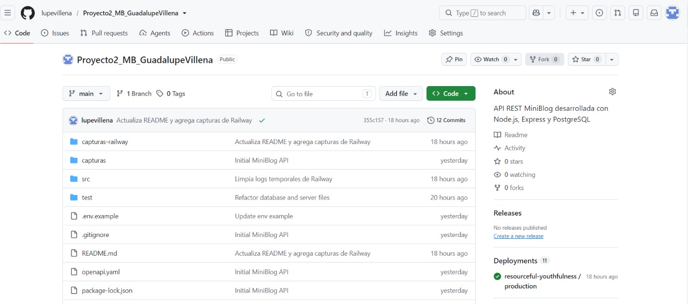

2.Se conectó el repositorio de GitHub con Railway.
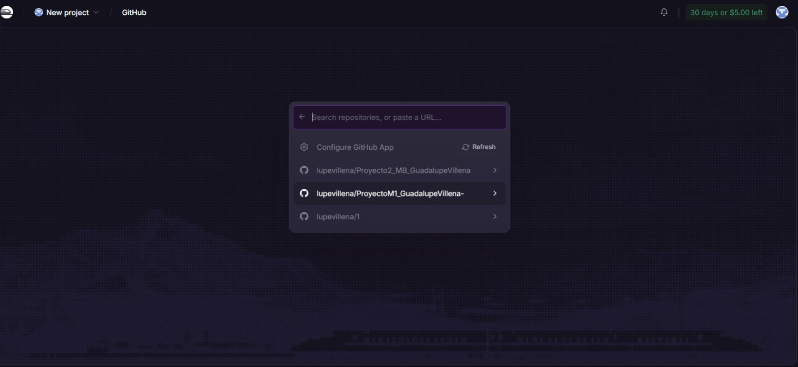

3.Se creó un servicio PostgreSQL dentro del proyecto de Railway.
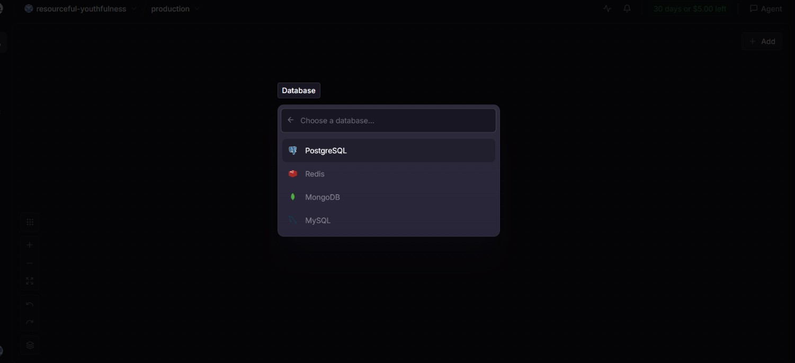

4.Se configuraron las variables de entorno de la aplicación.
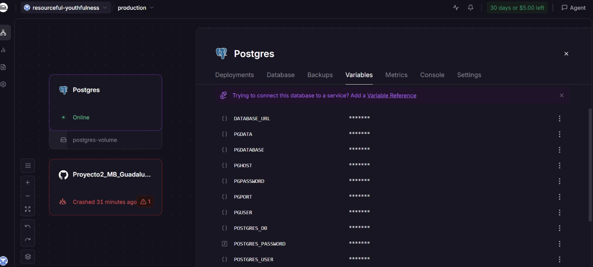

5.Se configuraron las referencias internas entre la API y PostgreSQL.
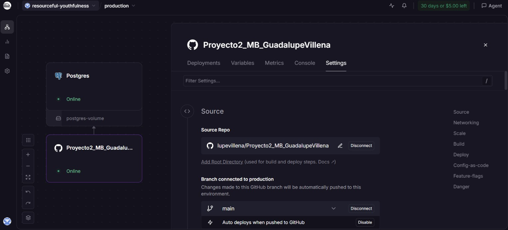

6.Se verificó el deployment exitoso de la API en Railway.
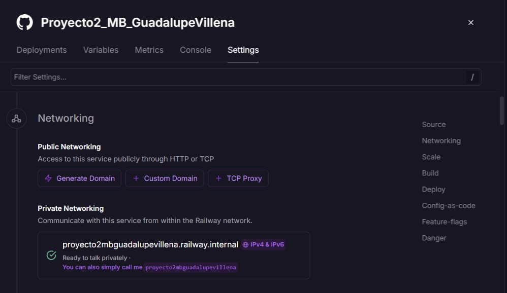

7.Se configuró el comando de inicio de la aplicación con npm start.


8.Se ejecutó setup.sql en PostgreSQL para crear las tablas authors y posts.
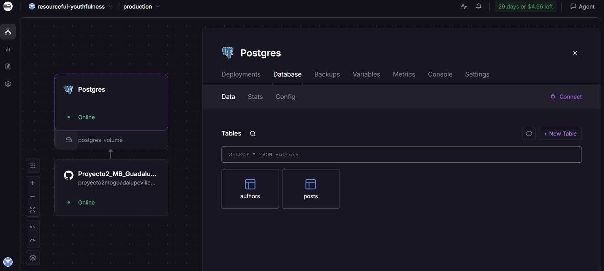

9.Se generó un dominio público para acceder a la API.
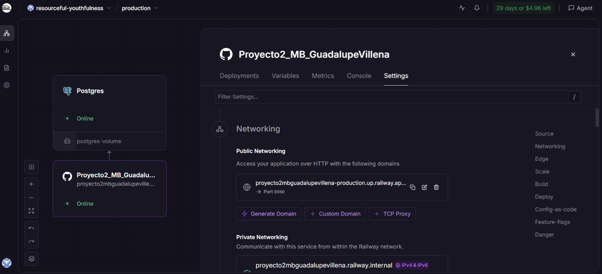

10.Se verificaron los endpoints y la documentación Swagger desde la URL pública.
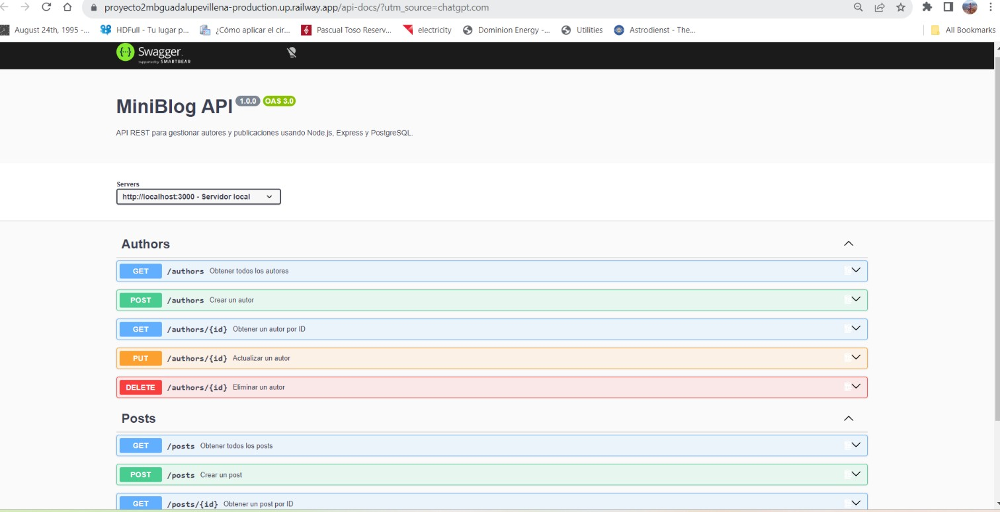

### Variables de entorno en Railway

La aplicación utiliza las siguientes variables de referencia para conectarse al servicio PostgreSQL:

```env
DB_USER=${{Postgres.PGUSER}}
DB_HOST=${{Postgres.PGHOST}}
DB_NAME=${{Postgres.PGDATABASE}}
DB_PASSWORD=${{Postgres.PGPASSWORD}}
DB_PORT=${{Postgres.PGPORT}}
```

Railway proporciona automáticamente la variable `PORT` utilizada por la aplicación en producción.

### Internal URL

La comunicación entre la aplicación y PostgreSQL se realiza mediante la red privada de Railway.

El host interno utilizado por PostgreSQL es:

```text
postgres.railway.internal
```

La aplicación utiliza este valor a través de la variable `DB_HOST`.

### URL pública

```text
https://proyecto2mbguadalupevillena-production.up.railway.app
```

### Endpoints en producción

```text
https://proyecto2mbguadalupevillena-production.up.railway.app/
```

```text
https://proyecto2mbguadalupevillena-production.up.railway.app/authors
```

```text
https://proyecto2mbguadalupevillena-production.up.railway.app/posts
```

### Swagger en producción

```text
https://proyecto2mbguadalupevillena-production.up.railway.app/api-docs
```

## Repositorio

GitHub:

```text
https://github.com/lupevillena/Proyecto2_MB_GuadalupeVillena
```

## Uso de Inteligencia Artificial

Durante el desarrollo del proyecto se utilizó asistencia de Inteligencia Artificial como herramienta de apoyo.

Se utilizó principalmente para:

- Comprender y organizar los requisitos del proyecto.
- Organizar la arquitectura de rutas, servicios y middlewares.
- Revisar errores durante el desarrollo.
- Apoyar la integración entre Express y PostgreSQL.
- Revisar consultas SQL parametrizadas.
- Crear y revisar tests automáticos con Jest y Supertest.
- Crear y revisar la documentación OpenAPI/Swagger.
- Revisar validaciones y manejo de errores.
- Configurar y solucionar errores durante el deployment en Railway.
- Configurar la conexión entre la aplicación y PostgreSQL en Railway.
- Apoyar la documentación final del proyecto.

Las funcionalidades fueron probadas durante el desarrollo antes de la entrega.

### Evidencias del uso de Inteligencia Artificial

Durante el desarrollo del proyecto se utilizó ChatGPT como herramienta de apoyo para resolver problemas encontrados durante la implementación y ejecución de la API.

A continuación se muestran algunos ejemplos del proceso de depuración realizado con asistencia de Inteligencia Artificial.

#### 1. Revisión del endpoint `GET /authors/:id`

Durante las primeras pruebas se detectó un problema al consultar un autor por ID mediante `GET /authors/:id`. En lugar de obtener la información esperada del autor, la aplicación devolvía una respuesta incorrecta.

Se utilizó ChatGPT para revisar la definición de la ruta y analizar el código relacionado con este endpoint.

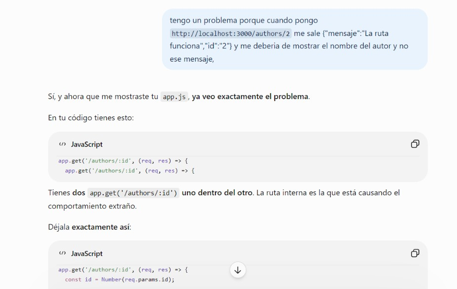

#### 2. Diagnóstico de la carga de rutas

Después de revisar el código, el endpoint continuaba sin responder como se esperaba. Se realizaron pruebas adicionales para comprobar si las rutas de Express estaban siendo cargadas correctamente por la aplicación.

ChatGPT fue utilizado como apoyo para definir pruebas temporales de diagnóstico y revisar el comportamiento del servidor.

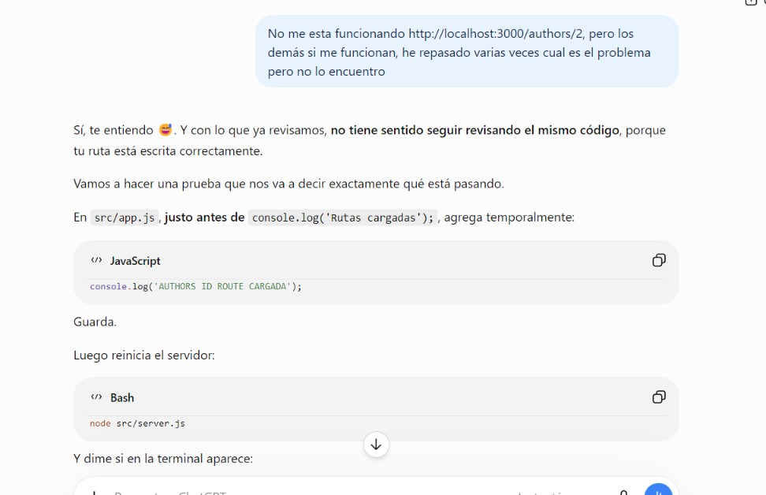

#### 3. Verificación del funcionamiento del servidor

Durante el proceso de depuración se identificó que parte del problema estaba relacionado con la ejecución del servidor. Se realizaron diferentes pruebas desde la terminal hasta comprobar que Express y las rutas principales estaban funcionando correctamente.

Esto permitió verificar el funcionamiento de `GET /` y `GET /authors` antes de continuar con el resto de los endpoints.

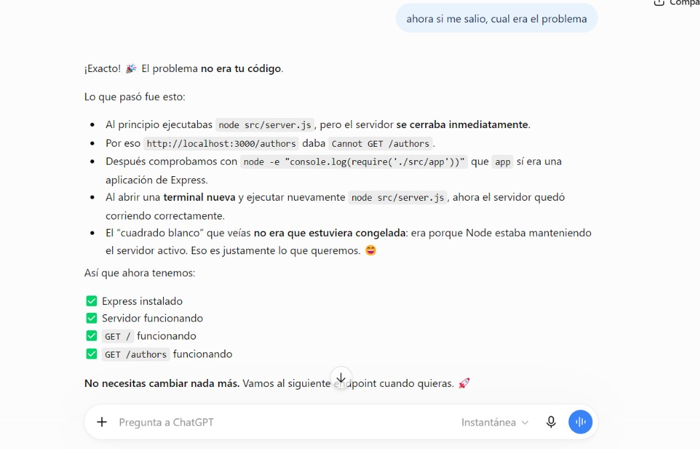

#### 4. Interpretación del comportamiento de la terminal

Durante las pruebas también surgió una duda porque la terminal parecía no mostrar una respuesta después de ejecutar el servidor.

Se utilizó ChatGPT para interpretar este comportamiento y comprender que un proceso de Node.js puede permanecer activo mientras el servidor está ejecutándose y esperando solicitudes.

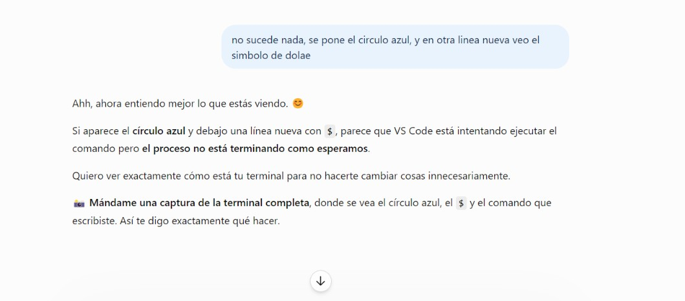

Estas consultas se utilizaron como apoyo durante el proceso de aprendizaje, depuración y desarrollo del proyecto. Las soluciones aplicadas fueron posteriormente verificadas mediante la ejecución de la API, pruebas de los endpoints y tests automáticos con Jest y Supertest.

## Autor

Guadalupe Villena